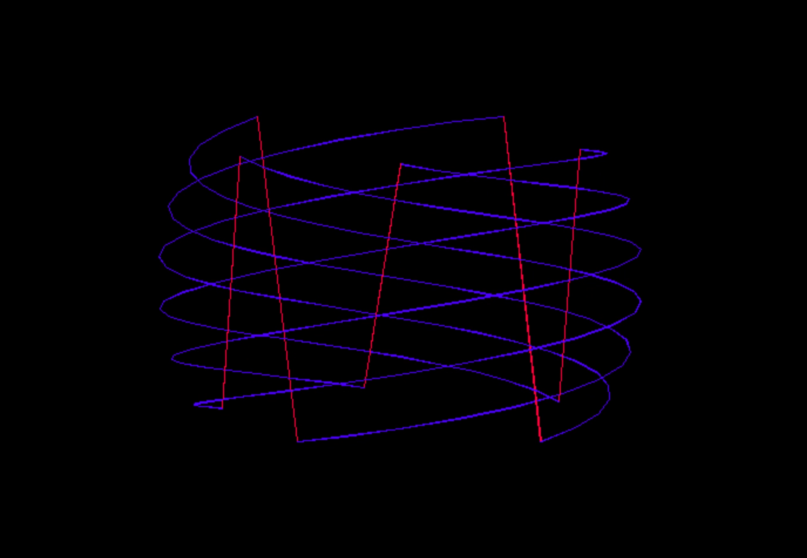

# MicroTone
A simple synth to allow parametrization over different musical scales and keymaps, as well as oscillators, envelopes. It enables manipulating signals. Signals are essentially generators
of values, they can be oscillators, envelopes or keypreses too.

# Signals
Signal is an abstract class. To define a subclass one need to define the step method (and possibly override the constructor or _initialize when needed). An active signal gives float signed numbers, some signals do terminate and do that by returning None and when this happens they continues returning None if next is called on them. The abstract class implements some checks over the concrete classes.

# Oscillators
An Oscillator is a Signal. In [oscillators.py] are defined Triangle, Square, Sine and SawTooth Oscillators. This is an handy way to define a Signal having a function and its supposed (or enforced) period.

# Settings
In settings it is possible to load the keymaps and the scale system as well as define the constants of the used ADSR envelope. At present time only two scales and two relative keymaps are implemented: dodecaphonic scale (with a mapping resambling the piano keyboard on a PC keyboard) and isomorphic (where more PC keys are used, going up in pitch diagonally NE). However the two couple of choices are independent.

## Screenshot
